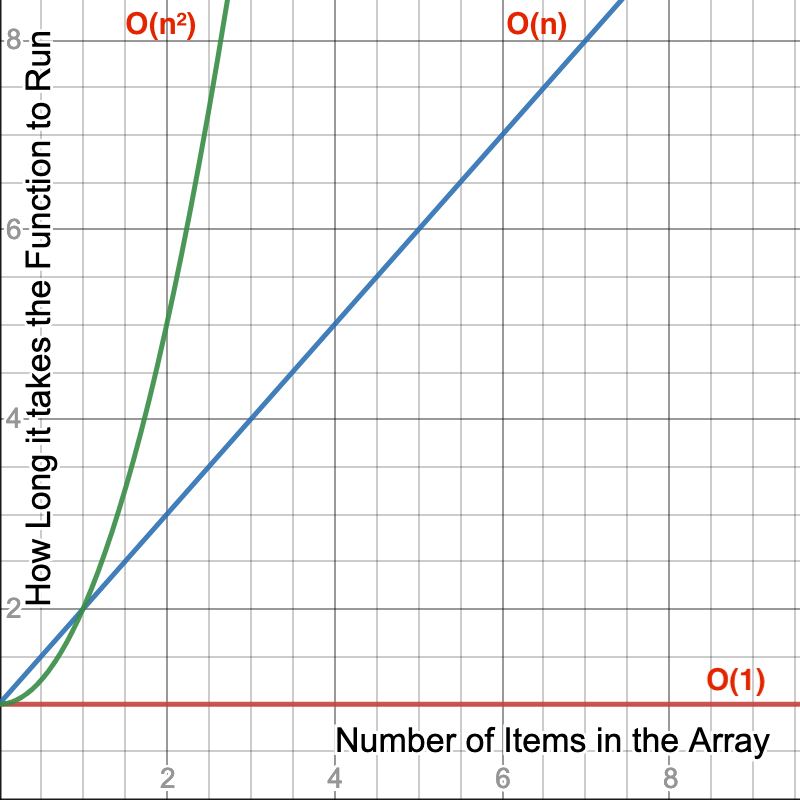
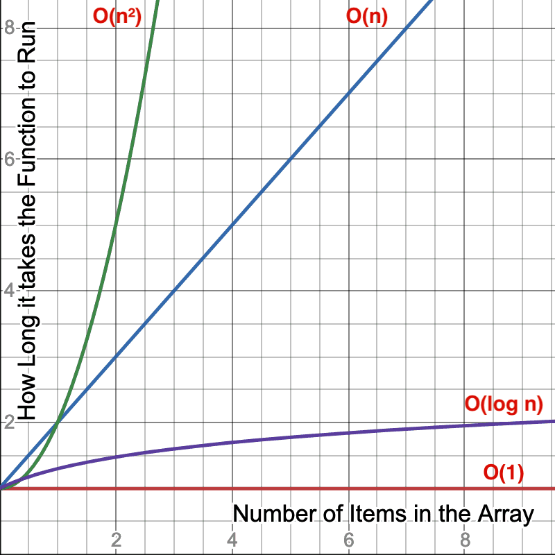

Big O is the way we analyze how efficient algorithms are (or code in this case) without getting too mired in the details. We can model how much time any function is going to take given n inputs (think an array of length `n`), but in reality we're interested in the order of magnitude of the number and not necessarily of the exact figure.

Example: I don't particularly care if a function takes 300 milliseconds versus 330 milliseconds given 1,000 inputs, but I do care if it takes 300 milliseconds versus 30 seconds. This would be a difference in an order of magnitude, or basically we're saying we only care if the difference is large.

Enter Big O. Think of the O as a vacuum that sucks in all the unimportant information and just leaves you with the important stuff. Let's look at a purely mathematical perspective for a second. Say we have the equation 3x² + x + 1. If we plug in 5, the first term will be 75, the second term will be 5, and the third will be 1.

> A "term" in mathematics just means one piece of the equation (normally separated by + or - signs). In 3x² + x + 1, 3x² is the first term, x is the second, and 1 is the third.

In other words, most of the piece of the pie comes from the first term, to the point we can just ignore the other terms. If we plug in huge numbers, it becomes even more apparent. IE if we do 5,000,000, the first term is 75,000,000,000,000, the second is 5,000,000, and the last 1. A huge gap.

Hence this is what Big O does; we ignore the little parts and concentrate on the big parts. Keeping with 3x² + x + 1, the Big O for this equation would be O(n²) where O is just absorbing all the other fluff (including the factor on the biggest term.) Just grab the biggest term. So for n terms, it's going take us n\*n time to go through our inputs. So let's see how to derive this from an algorithm.

```javascript
function crossAdd(input) {
  var answer = [];
  for (var i = 0; i < input.length; i++) {
    var goingUp = input[i];
    var goingDown = input[input.length - 1 - i];
    answer.push(goingUp + goingDown);
  }
  return answer;
}
```

This is O(n) because we go through all the inputs once in a loop.

```javascript
function find(needle, haystack) {
  for (var i = 0; i < haystack.length; i++) {
    if (haystack[i] === needle) return true;
  }
}
```

Still O(n). Unless we say otherwise, we're assuming worst case scenario. In this worst case, the needle would be the last element.

```javascript
function makeTuples(input) {
  var answer = [];
  for (var i = 0; i < input.length; i++) {
    for (var j = 0; j < input.length; j++) {
      answer.push([input[i], input[j]]);
    }
  }
  return answer;
}
```

This would be O(n²). For every input, we have to go through a full loop inside of another full loop, meaning we're doing a lot of work! This is the trick: look for loops. A loop inside of a loop inside of a loop would likewise be O(n³).

If we have no loops and just do something and exit/return, then it's said we're doing it in constant time, or O(1).

```javascript
function getMiddleOfArray(array) {
  return array[Math.floor(array.length / 2)];
}
```

This would be O(1) because no matter how long the array is, this still takes the same amount of time to do.

For some people, it's helpful to use a graph to visualize what we're talking about here



Here we see a graph that represents the more items we put in a array, how long does it take for the function to complete. The red graph represnts O(1) like our `getMiddleOfArary` function. You can throw an array of 1,000,000 at it and it still takes the same amount of time as if the array was 10 big.

The blue line represents a function that takes longer based on how many items are in the array similar to `crossAdd` or `find` and it grows a steady rate. If it takes 10ms to run a function with a 100 items in it, we could reasonably expect it would take 10 times longer-ish (remember, these are broad strokes, not precise figures) if we had 10 times the amount of things in the array.

The green line is where we get start getting scary. For every item we add to the array, it takes exponentially more time to complete the operation. Adding 10x the items could cause a function to takes 100x longer since it's O(n²). It gets even scarier at O(n³) as it would take 1000x longer.

We'll get more into it later, but you can also have O(log n) if a code employs a divide-and-conquer strategy (often recursive,) meaning as you add more terms, the increases in time as you add input diminishes. We'll talk more about that with merge and quick sort.



Notice the purple line we added. Now as we add more terms to the array, it takes less and less time because the function can make some use of some tricks to take shortcuts. We'll dig into these later in the course.

## Okay, sure, but why

This sort of analysis is useful for taking a high level view. It's a useful tool for deciding if your designed implementation is going to much the performance profile that you need.

A good example would be if we were designing a comment system for a site and it had a sorting and filtering ability. If this is for a school and there would only ever be a few comments at a time, we probably don't need to do too much Big O analysis because it's such a small set of people that a computer can overcome just about any computational inefficiency we have. In this case I'd value human time over computer time and just go with the simplest solution and not worry about the Big O unless performance because a problem later.

Okay, now, if we're designing a comment system but it's for Reddit.com, our needs change _dramatically_. We're now talking about pipelines of millions of users making billions of comments. Our performance targets need to change to address such volume. A O(n²) alogrithm would crash the site.

This is absolutely essential to know about Big O analysis. It's useless without context. If you're asked is in a situation if a O(n) or a O(n²) your answer should be "it depends" or "I need more context". If the O(n) algorithm is extremely difficult to comprehend and the O(n²) algorithm is dramatically easier to understand and performance is a total non-issue, then the O(n²) is a much better choice. It's similar to asking a carpenter if they want a hammer or a sledgehammer without any context. Their answer will be "what do you need me to do?".
