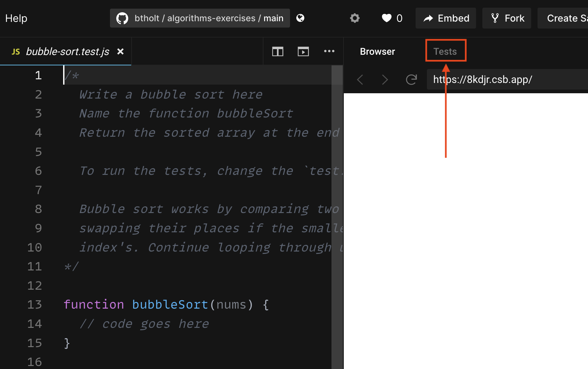
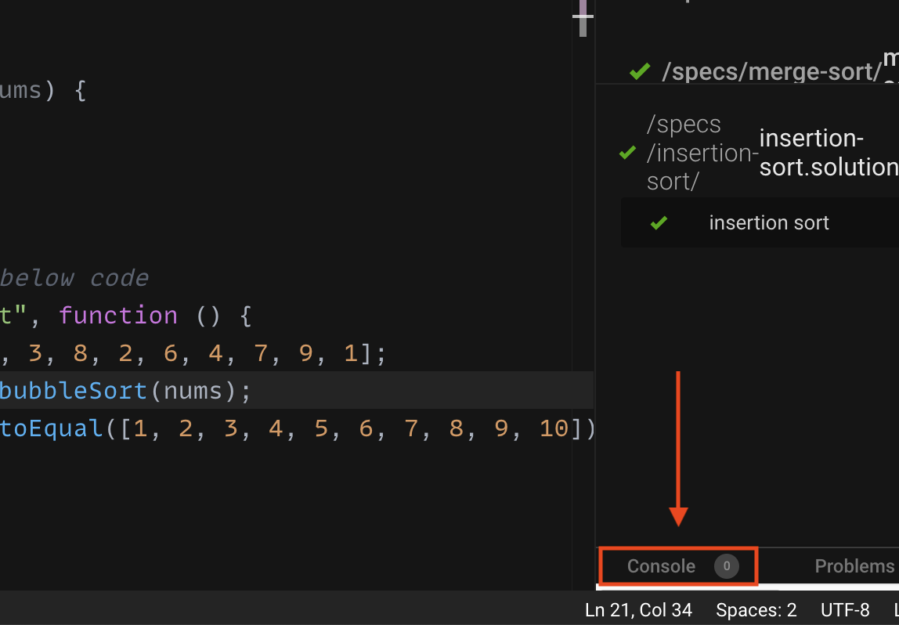

You have two options on how to do the exercises in this course.

## CodeSandbox

CodeSandbox is an online code editor based on Visual Studio Code and it's a great tool for sharing code. I'm a fan. I will be using this for the duration of the class. It has a great built-in test suite that we'll use.

Click the above button and it will take you to a ready-to-go CodeSandbox. I will suggest that you sign up for your own create and then fork my CodeSandbox so you can keep a copy of the code you write for yourself.

CodeSandbox will run the tests for you automatically, you just have to navigate to the test runner. Here's a screenshot of where it is.

There is a console built in to CodeSandbox, I'd suggest using that. It's a lot less noisy. Click here to access it.

## Locally

We can also do it the good ol' fashioned way: fork the repo on GitHub (so you can keep your own copy), clone the repo to your computer, and run all the tests locally.

[Click here to get to head to my repo][gh]. Be sure to fork and then clone.

Once you've clone it locally, run `npm install` then run `npm run test`. This will run all the files in your repo with `*.test.js` extensions. If you run `npm run test:watch` it will run Jest in its interactive mode, would definitely suggest trying that. It's fun.

## The Code!

In the `specs/` directory is a bunch of subdirectories where all the tests are. Your goal throughout this course is to make these tests pass. In each directory there at tests that called `*.test.js` that you will be modifying to make them pass. Right now all their tests will say `test.skip(…)`. Anything with that `skip` will not run that test. As soon as you remove the `.skip` so it just says `test(…)` it will start running those tests. I do that because CodeSandbox will run the tests as you type. It makes it really easy to make a mistake that will lock up your browser with infinite recursion or infinite looping. Try to write you code first, then remove the skip. **Save your work before running it.**

There are also `*.solution.test.js`. These are the correct answers I wrote. This is not a test. The only cheating you can do in this course is cheat yourself out of learning. I've found I frequently learn the most when I struggle a bit to get to there. Allow yourself to struggle. Think about it a lot. Walk away and come back. But there's a difference between spinning your wheels and learning. If you find yourself doing the former, take a gander at the solution and see if that helps you wrap your mind around it. Do what's best for your learning. Copying a solution is way better than giving up. Remember this is really hard.

[gh]: https://github.com/btholt/algorithms-exercises
