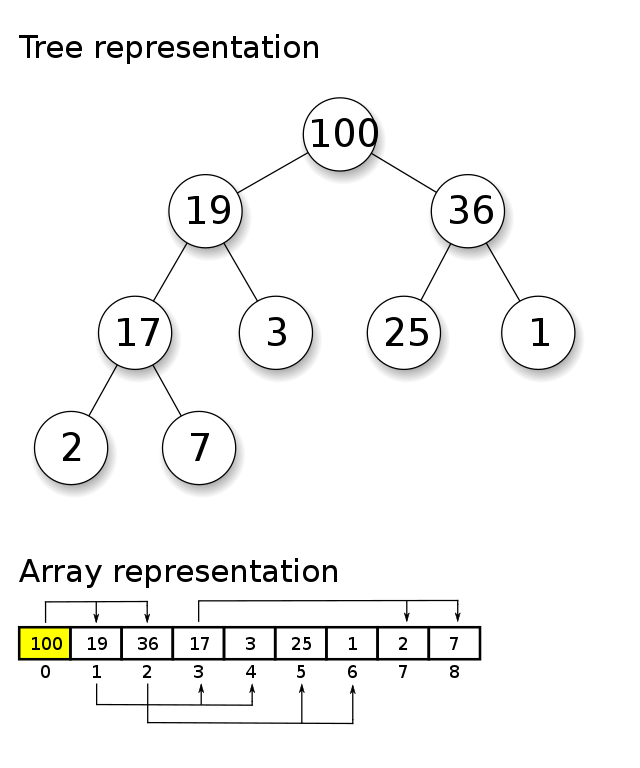

<sup>Swfung8, CC BY-SA 3.0 <https://creativecommons.org/licenses/by-sa/3.0>, via Wikimedia Commons</sup>

Back to sorting! We covered most of our sorts earlier in the course but this one required knowledge of trees before it was going to make sense.

Let's first address what a heap is. A heap is an array that represents a tree data structure and has to be sorted in a particular way to represent that tree. Priority queues are often represented as heaps and often those two terms are used interchangeably even if the the priority queue is implemented a different way.

> A priority queue is a normal queue that when you queue something it has a priority associated with it. Things that are higher priority are dequeued first. Think of your Internet traffic and how it handles data packets. If you're both syncing your Dropbox and watching Netflix, the Netflix packets would be higher priority because if you drop those the video stutters whereas the Dropbox stuff can happen whenever and you'd never notice. This would be well modeled as a priority queue. And those are usually stored as heaps.

We're going to be talking about binary heaps today but know there are others. A binary heap translates to a binary tree, similar to the binary search trees that we covered earlier. Let's list out what makes a BST (binary search tree) and a binary heap different

- A binary heap is an array; a BST is made up of node objects (typically.)
- In a BST, there is a strict order where a left child is always smaller than the parent and the right node is always greater. This is not true of a binary heap. The only guarantee of binary heap is the parent is greater than the children, there are no guarantees between sibling nodes.
- Similar to the above point, if you do an in-order traversal of a BST, you'll get a sorted list. This does not work in a binary heap.
- A binary heap is a "complete binary tree." This means it's as compact as possible. All the children of each node are as full as they can be and left children are filled out first. This is not true of a BST: they can be sparse.

Binary heaps come in two falvors: max heaps and min heaps. We'll be dealing with max heaps (which help you find the greatest number in the heap) but you can imagine that if you flip all the comparisons you'd have a min heap (which helps you find the smallest number.)

So this is why a priority queue is often a binary heap: it's very easy to tell the largest number in a binary heap. None of the other is guaranteed, but once you dequeue (or take the next element off) it's easy to find the next item in the queue. In fact, that's how heapsort works: you construct an internal priority queue and then remove an item at a time and stick it at the end and then find the next largest item in the priority queue; rinse and repeat.

The way to represent a binary tree as an array is that for any index of an array _n_, its left child is stored at 2n + 1; and its right child is at 2n + 2. The root node will always be at 0. That means the root node's left child is at 1 and right child is at 2. 1's left child is at 3 and right is at 4.



<sup>Kelott, CC BY-SA 4.0 <https://creativecommons.org/licenses/by-sa/4.0>, via Wikimedia Commons</sup>

Once you construct a heap, removing an item from it is done in constant time since you need to find the next largest node to move to the root. This process is typically called _heapify_. In order to construct a max heap, you run heapify starting at the middle of the array and work backwards to the root. You don't need to do it from the end because heapify will inherently look at those nodes.

So the process of heapsort is

- Make the array a max heap
  - To make a max heap, you'll run have to heapify on the first half of the array, going backwards. Your loop will looking something like this: `for (let i = Math.floor(array.length / 2) - 1; i >= 0; i--)`
- Loop over the array / max array, dequeuing the root node (which will give you the largest item) and swapping that with last item in the array
- After dequeuing each item, run heapify again (same function we used to create the heap) once to find the next root node
- Next loop you'll dequeue the root node and swap it with the second-to-last item in the array and run heapify again.
- Once you've run out of items to dequeue, you have a sorted array! Let's see what that looks like.

```text
// initial array
[5, 3, 2, 10, 1, 9, 8, 6, 4, 7]

// heapify the array
start at index 4, value 1
left child is index 9 value 7, right child is index 10, out of bounds
7 is larger than 1, swap left child and parent
[5, 3, 2, 10, 7, 9, 8, 6, 4, 1]
call heapify on index 9, does nothing

i-- index 3, value 10
left child is index 7 value 6, right child is index 8 value 4
neither is larger than 10
nothing to do, next iteration

i-- index 2, value 2
left child is index 5 value 9, right child is index 6 value 8
9 is the largest number, swap with parent
[5, 3, 9, 10, 7, 2, 8, 6, 4, 1]
call heapify on index 5, does nothing

i-- index 1, value 3
left child is index 3 value 10, right child is index 4 value 7
10 is in the largest number, swap with parent
[5, 10, 9, 3, 7, 2, 8, 6, 4, 1]
call heapify on index 3
left child is index 7 value 6, right child is index 8 value 4
6 is larger, swap with parent
[5, 10, 9, 6, 7, 2, 8, 3, 4, 1]
call heapify on index 7, does nothing

i-- index 0, value 5
left child is index 1 value 10, right child is index 2 value 9
10 is in the largest number, swap with parent
[10, 5, 9, 6, 7, 2, 8, 3, 4, 1]
call heapify on index 1
left child is index 3 value 6, right child is index 4 value 7
7 is larger, swap with parent
[10, 7, 9, 6, 5, 2, 8, 3, 4, 1]
call heapify on index 4
left child is index 9 value 1, right child is index 10, out of bounds
parent is larger, does nothing
```

Now our array is officially a heap. Now we can begin dequeuing items and sorting our array.

```text
Swap 10 and 1
[1, 7, 9, 6, 5, 2, 8, 3, 4, 10]
call heapify on index 0
left child is index 1 value 7, right child is index 2 value 9
9 is the larger, swap with parent
[9, 7, 1, 6, 5, 2, 8, 3, 4, 10]
call heapify on index 2
left child is index 5 value 2, right child is index 6 value 8
8 is larger, swap with parent
[9, 7, 8, 6, 5, 2, 1, 3, 4, 10]
call heapifiy on index 6, does nothing since children are out of bounds

Swap 9 and 4
[4, 7, 8, 6, 5, 2, 1, 3, 9, 10]
call heapify on index 0

Continue swapping the first element (the root) and last element of the heap
and then call heapify on element 0
After all these iterations, the array will be sorted
```

Hopefully this demonstrates how the it works! Go give it a shot to implement.

## Exercises

[][sb]

We're going to work on [/specs/heap-sort/heap-sort.test.js][gh]. Go give that a shot.

[gh]: https://github.com/btholt/algorithms-exercises/blob/main/specs/heap-sort/heap-sort.test.js
[sb]: https://codesandbox.io/s/github/btholt/algorithms-exercises/tree/main?file=/specs/heap-sort/heap-sort.test.js
