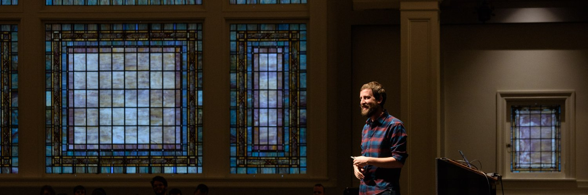

Welcome! Hello! This is the Complete Intro to Computer Science. I'm so excited to share with you some of my knowledge that I've earned working in the field. The skills here I picked up in my first few years of college. While you may not necessarily write a bubble sort at work, you will absolutely use principles and techniques learned here for the rest of your career. In particular, the skills here will help you interview for tech jobs since a lot of the questions asked by big tech companies are either directly related or derived from these classic algorithms and data structures which were largely invented in the 50s, 60s, and 70s. Understanding and writing these bits of codes will help these concepts sink into your thinking as well as the general science of trading off various aspects of how you write code.

> This course is hard. Like, really hard. Even if you've done all these things before, there is so much brain power to get through these exercises. Make sure you're practicing self-care by giving yourself the mental space necessary to learn these concepts. Don't expect to get everything on the first try. I'd recommend taking this course slowly, splitting it across multiple sessions. Don't get frustrated with yourself. There's a reason why colleges don't teach these things all at once.

## Who is this course for?

For you!

This course is for all levels of programmers who want to understand for the first time some of these algorithms and data structures or want more practice with them. This class for non-CS grads and CS grads alike.

This class expects familiarity with JavaScript and with programming. If you are looking for your first coding class, [try the Frontend Masters Boot Camp!][bootcamp]

## Who am I?

My name is Brian Holt and I am a principal program manager at Microsoft. I attended a few years of a computer science program in Utah before dropping out of college to pursue a career in coding. A lot of these concepts I learned in college or during my high school classes and for years I didn't really value what they meant to me. As I got into working at larger companies these concepts started surfacing more and more. It was then that I started to realize that not only did they concepts help you in whiteboarding interviews (they do) but they also teach you a way of thinking that's super valuable. Hopefully I can help you learn to love these methods of structured thinking and logic.

When I'm not working at Microsoft or working on Frontend Masters content I try to get away from my keyboard. I enjoy exercising (I'm on Peloton at [btholt][pelo] if you want exercise with me!), Islay Scotches, local beer, medium roast coffee, traveling around the world, playing with my adorable Havanese dog Luna, hanging out with my amazing wife [Niki][niki], and getting my ass kicked at Dota 2 and Overwatch. I'm passionate about people and helping them fulfill their own potentials, having amazing local experiences where ever I am, and having a drink with those I love.

Lastly, while I have your attention, just wanted to call some attention to my favorite charitable organizations. Spare a dollar for these fine people if you have one to give.

- [AnnieCannons][ac]
- [The Last Mile][tlm]
- [VetsWhoCode][vwc]
- [Legal Counsel for Youth and Children][lcyc]

## Special Thanks to Frontend Masters

I want to thank Marc and the whole Frontend Masters team explicitly. In addition to being family to me these are some of the most wonderful people I've ever met. You are reading or watching this course thanks to their hard work to make the world of tech more approachable with high quality instructors teaching what they know best. I want to thank them for creating the platform, garnering a community of knowledge-seeking developers, and giving me incentive and a platform to speak to you all. One specific kindness is that while the videos are on the platform (and I think they are worth every penny to watch) they let me release this website and materials as open source so every person can acquire the knowledge.

Thanks Frontend Masters. Y'all are the best.

## The Socials

Please catch up with me on social media! Do note I'm not the best at responding to private messages, especially Twitter DMs and LinkedIn messages!

- [Twitter][tw]
- [LinkedIn][li]
- [GitHub][gh]
- [Peloton][pelo] (you have to be a member and signed in for this link to work)

[command-line]: https://frontendmasters.com/courses/linux-command-line/
[web-dev]: https://frontendmasters.com/courses/web-development-v2/
[niki]: https://twitter.com/ImNikiHolt
[lcyc]: http://lcycwa.org/donate
[tw]: https://twitter.com/holtbt
[gh]: https://github.com/btholt
[li]: https://linkedin.com/in/btholt
[course]: https://github.com/btholt/complete-intro-to-linux-and-the-cli
[tlm]: https://thelastmile.org/donate/
[ac]: https://anniecannons.org/invest
[vwc]: https://vetswhocode.io/donate
[pelo]: https://members.onepeloton.com/members/btholt/overview
[bootcamp]: https://frontendmasters.com/bootcamp/
