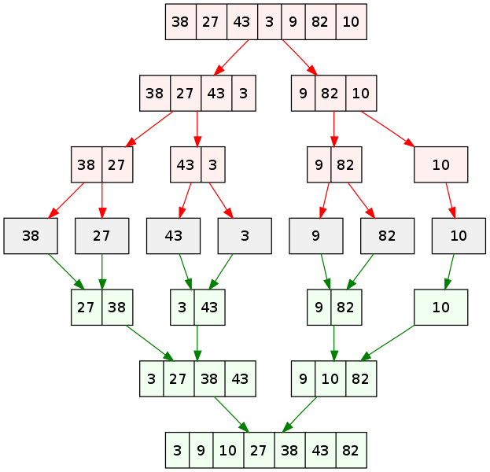

<sup>Swfung8, CC BY-SA 3.0 <https://creativecommons.org/licenses/by-sa/3.0>, via Wikimedia Commons</sup>

We're going to take our new found super power of recurison and apply it to sorting a list.

So what if we have a big list that's unsorted? Well, what if we break it into two smaller lists and sort those? Okay, great but now we just have the same problem just smaller. Cool, let's break that those each into smaller lists and try again.

Eventually we're going to end up with lists of length 1 or 0. By definition (as I keep saying lol) a list of 1 or 0 is already sorted. Done! Sounds like a base case, doesn't it?

Okay, so now we have two sorted lists. What if we merged them back together in a way that we're sorting as we go. We'll take those two smaller sorted lists and combine them back into one larger sorted list. And then we'll do that with the bigger lists until we've merged them all back into one sorted list.

So we need two functions. One is the first function to break down the big lists into smaller lists (the recursive function) and the other is a function that takes two **sorted** (I bold because this function should assume that these two lists it receives are always sorted already) and returns back one sorted function. The first function is recursive and the second is not.

Let's do an example. Recursion is a bit hard to diagram but stick with me. We'll do it in the order it would be evaluated. I'm using the `//` to show you that everything after the `//` isn't being called now but we'll come back to when recursion on the left side of the call finishes. I'm using the `-- depth <number>` to show you we are `<number>` calls deep in the call stack.

```text

mergeSort([1, 5, 7, 4, 2, 3, 6]) -- depth 0

mergeSort([1, 5, 7, 4]) // mergeSort([2, 3, 6]) -- depth 1

mergeSort([1, 5]) // mergeSort([7, 4]) -- depth 2

mergeSort([1]) // mergeSort([5]) -- depth 3
[1] is of length one. Base case. Return sorted list [1] -- depth 3

mergeSort([5]) -- depth 3
[5] is of length one. Base case. Return sorted list [5] -- depth 3

merge([1], [5]) -- depth 3
Is 1 or 5 smaller? 1. Add to end. [1]
Left array is empty, concat right array. [1, 5]
Return sorted array [1, 5].

mergeSort([7, 4]) -- depth 2

mergeSort([7]) // mergeSort([4]) -- depth 3
[7] is of length one. Base case. Return sorted list [7] -- depth 3

mergeSort([4]) -- depth 3
[4] is of length one. Base case. Return sorted list [4] -- depth 3

merge([7], [4]) -- depth 3
Is 7 or 4 smaller? 4. Add to end. [4]
Right array is empty, concat left array. [4, 7]
Return sorted array [4, 7]

merge([1, 5], [4, 7]) -- depth 2
Is 1 or 4 smaller? 1. Add to end. [1]
Is 5 or 4 smaller? 4. Add to end. [1, 4]
Is 5 or 7 smaller? 5. Add to end. [1, 4, 5]
Left array is empty, concat right array. [1, 4, 5, 7]
Return sorted array [1, 4, 5, 7]

mergeSort([2, 3, 6]) -- depth 1

mergeSort([2, 3]) // mergeSort([6]) -- depth 2

mergeSort([2]) // mergeSort([3]) -- depth 3
[2] is of length one. Base case. Return sorted list [2]

mergeSort([3]) -- depth 3
[3] is of length one. Base case. Return sorted list [3]

merge([2], [3]) -- depth 3
Is 2 or 4 smaller? 2. Add to end. [2]
Left array is empty, concat right array. [2, 3]
Return sorted array [2, 4]

mergeSort([6]) -- depth 2
[6] is of length one. Base case. Return sorted list [6]

merge([2, 3], [6]) -- depth 2
Is 2 or 6 smaller? 2. Add to end. [2]
Is 3 or 6 smaller? 3. Add to end. [2, 3]
Left array is empty, concat right array. [2, 3, 6]
Return sorted array [2, 3, 6]

merge([1, 4, 5, 7], [2, 3, 6]) -- depth 1
Is 1 or 2 smaller? 1. Add to end. [1]
Is 4 or 2 smaller? 2. Add to end. [1, 2]
Is 4 or 3 smaller? 3. Add to end. [1, 2, 3]
Is 4 or 6 smaller? 4. Add to end. [1, 2, 3, 4]
Is 5 or 6 smaller? 5. Add to end. [1, 2, 3, 4, 5]
Is 7 or 6 smaller? 6. Add to end. [1, 2, 3, 4, 5, 6]
Right array is empty, concat left array. [1, 2, 3, 4, 5, 6, 7]
Return sorted list [1, 2, 3, 4, 5, 6, 7]

```

This was a journey but I wanted you to see the whole logic of it, piece by piece.

Here's another visual representation of it.



<sup>VineetKumar at English Wikipedia, Public domain, via Wikimedia Commons</sup>

## Big O

This is always a fun one to discuss. Let's talk about _worst_ case scenario here. Well, every case is the worst case scenario. And the best. And the average. No matter what, the array always gets broken down into lists of 1 and then built back up. Notice that `mergeSort([2, 3, 6])` was already sorted but it didn't matter. So for merge sort all three of best, worst, and average case computational complexity the answer will be the same.

Let's about the Big O then. Every item in the array will be looked at least once. So that means that we're going to be at least O(n). Then we need to compare those items to other items in the array. But how many times? Does it diminish as the list gets longer or not? It turns out it does diminish.

Notice that the 1 in our example never gets compared to the 7 in the array. How? Well, when the array breaks down into smaller pieces, the 7 gets put in a group with 4. The 1 does get compared at one point to the 4 and gets sorted before the 4. We, by virtue of knowing that everything after 4 in that list larger than 4, don't need to compare 1 to each of those numbers. We get to take a short cut. So, as our array grows larger and larger, we get to take more and more shortcuts. This the hallmark of a `log n` sort of behavior: the larger the list gets, we get diminishing amounts of more things to do.

So let's combine our two terms together. This sort's computational complexity is O(n log n). And that's the best average/worst case for a general purpose sort that we're going to get. This will definitely be significantly faster than the O(n²) we've been seeing so far on larger lists.

What about spatial complexity? Notice we're creating and throwing away a lot of array. This isn't free, and on a large list can be a problem. Merge sort is among the worst because we'll create an array for every item in the array (plus a few more which would just be a coefficent so Big O wouldn't care) so the spatial complexity is O(n).

## Exercises

[][sb]

We're going to work on [/specs/merge-sort/merge-sort.test.js][gh]. Go give that a shot.

[gh]: https://github.com/btholt/algorithms-exercises/blob/main/specs/merge-sort/merge-sort.test.js
[sb]: https://codesandbox.io/s/github/btholt/algorithms-exercises/tree/main?file=/specs/merge-sort/merge-sort.test.js
