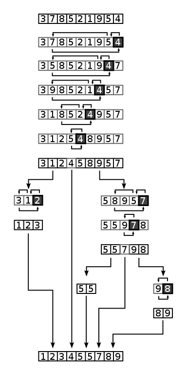

<sup>en:User:RolandH, CC BY-SA 3.0 <http://creativecommons.org/licenses/by-sa/3.0/>, via Wikimedia Commons</sup>

Quick sort is one of the most useful and powerful sorting algorithms out there, and it's not terribly difficult to conceptualize (compared to some algorithms we're not talking about anyway.) Above I mentioned that occasionally JavaScript doesn't merge sort for Array.prototype.sort. In those other cases, it's usually some variant on quick sort.

It's another divide-and-conquer, recursive algorithm but it takes a slightly different approach. The basic gist is that you take the last element in the list and call that the pivot. Everything that's smaller than the pivot gets put into a "left" list and everything that's greater get's put in a "right" list. You then call quick sort on the left and right lists independently (hence the recursion.) After those two sorts come back, you concatenate the sorted left list, the pivot, and then the right list (in that order.) The base case is when you have a list of length 1 or 0, where you just return the list given to you.

```text
[4,9,3,5] list
-> 5 is made the pivot since it's the last in the array
-> divide list into two lists, [4,3] and [9]
-> call quicksort on those two lists

[4, 3]
-> 3 is pivot
-> call quicksort on [] and [4]
-> those both return as is as they are the base case of length 0 or 1
-> concat [], 3, and [4]
-> return [3,4]

[9]
-> returns as this it is a base case of length 1

(back into the original function call)
-> call concat on [3,4], 5, and [9]
-> return [3,4,5,9]
```



<sup>Znupi, Public domain, via Wikimedia Commons</sup>

## Big O

What is the worst case for quick sort? A sorted list. The pivot would always be the largest number in the array, meaning the left array would always be full and the right array would always be empty. In order for us to get that log n magic instead of just n, we need to be able to skip some comparisons. If it's sorted, we will compare every number against every other so we'd end up with O(n²). Same would apply with a reverse-sorted list.

What's the best case scenario? It's actually the same the average case scenario: a randomly sorted list. That way the pivots will tend to be more in the middle so we'll get a good mix in our left and right arrays which is where that log n magic comes in. In these cases, it'll be O(n log n) like merge sort.

What about spatial complexity? In the way that I'm going to have you do it, it'll be O(n). We'll be creating new arrays for each recursive call. This makes quick sort more clear to understand and for now that's what we're optimizing for: the actual algorithmic thinking.

It is possible to implement quick sort as a destructive sort that operates in-place and uses some other tricks like tail call optimization. In this case its spatial complexity will be O(log n) as will still make some memory allocations on the call stack, but far fewer than merge sort does. For this reason, the spatially-effecient version of quick sort will frequently be favored over merge sort due to its lesser memory footprint.

## Variations

In addition to the memory effecient version discussed above, there are other tricks around the pivot that we can do to mitigate our worst case scenarios. The most common is called quicksort3 where you take the first element, the middle element, and the last element and takes the middle value as the pivot, guaranteeing at least that your pivot isn't the smallest or biggest element. It does add a few more comparisons to your sort so it does add overhead but at the benefit basically removing the worst case scenario. Others will just choose a random pivot each time. Most of the variations revolve around pivots.

## Exercises

[][sb]

We're going to work on [/specs/quick-sort/quick-sort.test.js][gh]. Go give that a shot.

[gh]: https://github.com/btholt/algorithms-exercises/blob/main/specs/quick-sort/quick-sort.test.js
[sb]: https://codesandbox.io/s/github/btholt/algorithms-exercises/tree/main?file=/specs/quick-sort/quick-sort.test.js
