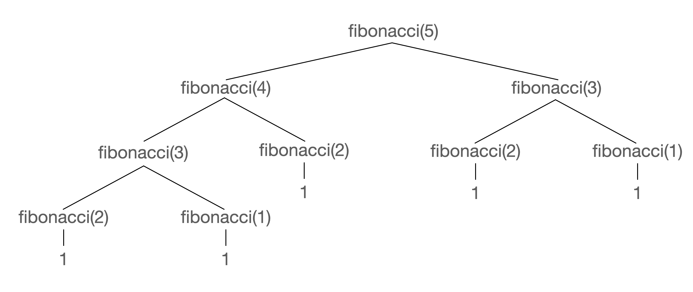

What do you do if you have a large, difficult-to-solve problem? You break it down into multiple smaller problems and see if you can solve those. Are those problems still too big? Break those down into smaller problems, and so-on-and-so-forth until you arrive at a problem you can solve.

Logically, this is similar to what we do with code some times. What if we need to sort a really big array? In some algorithms we'll break that really big array into two smaller arrays, and we'll break those arrays into two yet smaller lists until we have a list of one which is by-definition already sorted (we just described merge sort, we'll write that later in this course!)

## The Mechanics

In English, a recursive definition is when you try to define a word using the words themselves. "What is a seafarer?" "One who fares the seas." As you can see, this use of recursion isn't super useful. But let's see it in code.

A recursive function is a function that calls itself

```javascript
function countTo(max, current, list) {
  if (current > max) return;
  console.log(current);
  countTo(max, current + 1);
}

const counts = countTo(5, 1, []);
```

Notice that we call `countTo` inside of `countTo`. This is recursion. However this one isn't super useful as I could have easily use a for loop. However I wanted to show you a very simple case of recursion. Let's then talk about a bit more about when to use a recursive function.

## When it's useful

If you find yourself defining your problem into smaller versions of the same problem, it's a pretty good indication that recursion could be useful here.

Have you ever heard of the [fibonacci sequence][fibonacci]?

A fibonacci number is a number that is defined as the sum of the previous two previous fibonacci numbers. So `fibonacci(3)` is equal to `fibonacci(2) + fibonacci(1)`. So the answer to `fibonacci(100)` is `fibonacci(99) + fibonacci(98)`.

To generalize this, `fibonacci(n) = fibonacci(n - 1) + fibonacci(n - 2)`. This is a recursively defined problem.

So let's tackle this one piece at a time. The first question we have to ask ourselves is **what is the base case**. The base case is when we stop recursing. If we don't have a base case, then our recursion will spiral out of control and we will get a **stack overflow** (hence the name of the helpful website) when we run out of memory. In our case, our base case is that we are given that `fibonacci(2) = 1`, `fibonacci(1) = 1`, and `fibonacci(0) = 0`. _Almost always_ with recursion your base case will be the first line of your recursive function. You need a good reason for that not to be the case.

> There are negative fibonacci numbers. We're ignoring them.

Okay, so let's write our function then.

```javascript
function fibonacci(n) {
  // base case
  if (n === 2 || n === 1) {
    return 1;
  } else if (n <= 0) {
    return 0;
  }

  // recursive calls
  return fibonacci(n - 1) + fibonacci(n - 2);
}
```

A little mind-melting, right? Let's break it down really quick.



Let's break this down call-by-call. Since recursive functions will break down into further recursive calls, all of them eventually eventually end in a base case. In the `fibonacci(5)` call, you can see eventually all of them end up in n either equalling 2 or 1, our base case. So to get our final answer of 5 (which is the correct answer) we end up adding 1 to itself 5 times to get 5. That seems silly, right?

So what if we call `fibonacci(30)`? The answer is 832040. You guessed it, we add 1 to itelf, 832040 times. What if we call `fibonacci(200)`? Chances are you'll get a stack overflow.

Not very efficient here, but very elegant code. Here you'd need to trade off having readable code versus a relatively poor performance profile. If your use case says you'll only need to call no more than with n = 10, yeah, this is probably okay. If you need to call it with n = 200, you need to rewrite it to something different.

Here's the iterative solution:

```javascript
function fibonacci(n) {
  const sequence = [0, 1];
  for (let i = 2; i < n + 1; i++) {
    sequence.push(sequence[i - 2] + sequence[i - 1]);
  }
  return sequence[n];
}
```

Not terribly long, but it's definitely harder to get your mind around. Again, you'll need to balance your needs versus how readable the code is.

## Nested Addition Exercise

Let's say I give an array. In this array there are two types of things: numbers and more arrays. In those arrays, they too are numbers and more arrays. An example could be `[1, 2, 3, 4, 5, [6, 7, 8], 9, [[10, 11], 13, [14]]]`. This would take all of these numbers, regardless of how nested they are, and add them together.

The base case won't (probably) be the first thing in this exercise!

> 🚨 NOTE: By default, I put `test.skip` on all the tests so you can write the code before you run the tests. Write the code first that you think will work, then remove the `.skip` part. If you write an infinite loop or a runaway recursive function, this can lock up the browser. It's a good idea to save your work (either to your own repo or just copy/paste it out of CodeSandbox) in case you do crash it.

Go ahead and give it a shot here:

[][nested-arrays]

We're going to work on [/specs/recursion/nested-arrays.test.js][nested-arrays-gh]. Go give that a shot.

## Factorials Exercise

One more exercise for you, just to really hammer home recursion. Have you ever heard of factorials? It's a mathematical function that looks like this: `5!`. A factorial is `n * (n-1)!`. So `5! = 5 * 4!`. It really ends up being `5 * 4 * 3 * 2 * 1`. `1! = 1`.

Go ahead and give this a try. It's fairly similar to the previous fibonacci problem but a little different.

[][factorials]

We're going to work on [/specs/recursion/factorials.test.js][factorials-gh]. Go give that a shot.

[nested-arrays-gh]: https://github.com/btholt/algorithms-exercises/blob/main/specs/recursion/nested-arrays.test.js
[factorials-gh]: https://github.com/btholt/algorithms-exercises/blob/main/specs/recursion/factorials.test.js
[fibonacci]: https://en.wikipedia.org/wiki/Fibonacci_number
[nested-arrays]: https://codesandbox.io/s/github/btholt/algorithms-exercises/tree/main?file=/specs/recursion/nested-arrays.test.js
[factorials]: https://codesandbox.io/s/github/btholt/algorithms-exercises/tree/main?file=/specs/recursion/recursion.test.js
